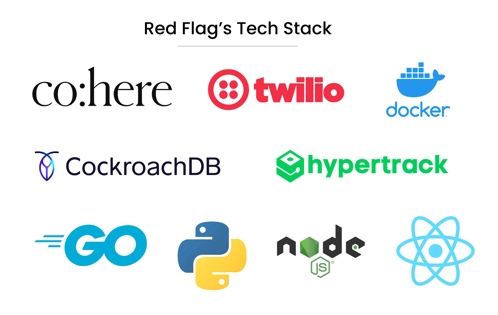

# Red Flags

## Our Mission

At RedFlags, our priority is to protect you, your family, and your community from any dangerous events. Whether you’re going to work in the morning, traveling with friends, or simply walking from place to place, RedFlag will alert you of nearby incidents and allow you to take timely action! As RedFlagers, our mission is to be the invisible bodyguard behind everyone, and ultimately, make the world a safer place.

> ***Please learn more about OUR STORY on Devpost!!! https://devpost.com/software/red-flag-dfhrbq***

## Our Tech Stack

## Our RedFlags works

RedFlags incorporates a number of different key technologies that enable us to provide insights to our users about their day to day lives and possible interactions with their surroundings. To help identify potential risk factors in our users' day-to-day lives, we analyse our users' travel routes beforehand. Knowing where our users' intend to travel, we could analyse a given area's safety to alert our users of potential hazards while simultaneously providing suggestions for our users' travel plans.

### Generating Safety Scores
Different parts of the city are assigned safety scores based on a number of factors. RedFlags **scrapes a multitude of news sources** (eg. Reddit, local news and law enforcement) to analyse the safety of a particular area (eg. a street or neighbourhood). While analysing these sources, we use AI to conduct sentiment analyse to better understand whether a place is safe or potentially dangerous. It also takes the date, relevance and reliability of information into account.

### Emergencies and Distress Signals
Besides taking preventative action, RedFlags is also able to take action when our users' face problems. When our users' encounter emergencies, RedFlags is able to notify relevant personel with the needed information for our users to find support. This includes contacting emergency services, notifying emergency contacts and sending a "distress alert" to nearby RedFlags users.

### Repository Structure
- `api`: This directory contains a REST api written in Golang that is packaged as a Docker container deployed on GCP. The API also interacts with our database CockroachDB using GORM.
- `scraper: Our scraper is written using the Colly framwork in Go. To analyse queried news data, we use **Cohere's Classify** to generate insights.
- `rf`: A frontend ui.
- `query`: Contains a script used for sentiment analysis.
- `secrets`: Store secrets such as API keys here!

## Why we chose our tools and frameworks

### Cohere
Using insights from **Cohere Classify**, we were able to quickly and efficiently implement NLP into our application. Cohere's **clear and detailed** documentation enabled us to rapidly prototype our application. Without Cohere, we could not have prototyped RedFlags so quickly!

### CockroachDB
**CockroachDB** provides us with distributed SQL which offers the beenfits of SQL such strong consistency and high-throughput performance. CockroachDB's distributed architecture also offers the redundancy and performance needed to serve urgent user requests and our demanding needs from data scraping and machine learning. Additionally, CockroachDB offers **Spatial support** which is critical for our application as we interact with a tonnes of location data of various streets. In a nutshell, CockroachDB is critical for our application and enables our application to scale.

### Twilio
**Twilio** offers more than just programmable SMS messages. Although we use Twilio to send SMS messages or phone calls, Twilio allows us to stream **real-time video** through WebRTC. This allows RedFlags to send live videofeed to relevant stakeholders (such as law enforcement) or to have video recordings of incidents if an incident occurs.

### HyperTrack
**HyperTrack** offers a number of features which support our use case. HyperTrack's live location tracking allows us to track our users' location to offer relevant insights in a timely manner.

